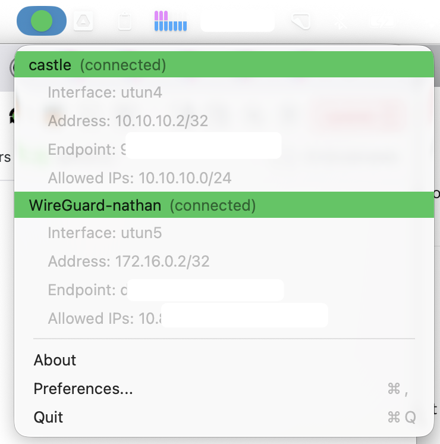

# WireGuard Multi Tunnel Menubar Tool

Fork of [aequitas/macos-menubar-wireguard](https://github.com/aequitas/macos-menubar-wireguard).

## Introduction

This is a macOS statusbar item (aka menubar icon) that wraps wg-quick. It allows you to have multiple tunnels enabled at once.

## Features

- Sit in your menubar
- Indicates if tunnels are enabled
- Bring tunnel up/down via one click
- **Support for having multiple tunnels enabled at once (Official Wireguard app doesn't support this)**
- Exit tunnels on quit
- ~~Fail miserably when brew/wg-quick is not installed or permissions on files are incorrect~~

## Installation

- Follow the instruction to [install WireGuard for macOS](https://www.wireguard.com/install/)
- Create a tunnel configuration file (eg: `/opt/homebrew/etc/wireguard/utun1.conf`)
- Build the application yourself using the instructions below.
- The next bit is needed because I don't have a Apple Developer account to properly sign the binary. If you don't like it consider building and signing the application yourself.
  - Start the App and get a dialog indicating the app is not signed
  - Go to: Preferences->Security & Privacy->General and click "Open Anyway"

#### Non-default Homebrew or `wg-quick` location

If WireGuard tools live outside the default prefix ([since 1.16](https://github.com/NorseGaud/macos-menubar-wireguard/releases/tag/1.16)), set helper paths with root `defaults` as described in [SECURITY.md](SECURITY.md#path-hardening).

## Building & Testing

Automation scripting is provided in this repository to make development a little easier. Primary development using Xcode is supported/preferred but some actions (integration testing, distribution build) are only available using `make`.

Continuous integration runs on GitHub Actions (`.github/workflows/ci.yml`) and executes `make test-unit` on each push and pull request.

To test the project and check code quality run:

    make test-unit

Or simply:

    make test

Integration tests require preparation and will ask for a `sudo` password once to install test configuration files in your Homebrew prefix (eg: `/opt/homebrew/etc/wireguard`):

    make prep-integration
    make test-integration

To run unit and integration tests together:

    make test-all

Code formatting should preferably by done by computers. To auto correct most violations run (this is also run before each `make test-unit` or `make check`):

    make fix

To build a distributable `.dmg` and install to `/Applications` (unit tests only, no sudo):

    make

Set the release version in the root `VERSION` file (for example `2.0.0`). `make` reads that value for distributable names and syncs `CFBundleShortVersionString` in both app and helper `Info.plist` files before archiving. Each distributable build (`make`, `make dist`, `make app`, …) increments `CFBundleVersion` in both plists so the helper stays in sync with the app. The `.dmg` is named with that version and build number (for example `WireGuardMultiTunnel-2.0.0-132.dmg`). Override once with `make version=2.0.1 build_number=140 dist` (skips auto-increment). CI skips the bump.

For a full release verification including integration tests:

    make test-all dist install

## Security

Privileged helper installation, XPC trust, path validation, and configuration redaction are documented in [SECURITY.md](SECURITY.md).

## License

This software as a whole is licensed under GPL-3.0

"WireGuard" and the "WireGuard" logo are registered trademarks of Jason A. Donenfeld.

## Roadmap

### Recently completed

- GitHub Actions CI (`.github/workflows/ci.yml`, `make test-unit` on push/PR)
- Privileged-helper security: XPC code-signing checks, validated tool paths, private-key redaction over XPC — see [SECURITY.md](SECURITY.md)
- Long tunnel config names (>15 characters) via deterministic `wg-quick` interface aliases
- Default Homebrew prefix `/opt/homebrew` with validated `brewPrefix` / `wgquickBinPath` overrides
- Menubar and menu UX: connected-tunnel highlighting, toggle-in-progress spinner, standard About panel, install-instructions entry when WireGuard tools are missing
- Release versioning from root `VERSION` file (synced into app and helper plists on `make dist`)
- macOS 12+ deployment target and updated Xcode / lint tooling (`AGENTS.md` for contributors)

### Planned

- Peer handshake / reachability status (beyond “interface is up”)
- Read live tunnel config via `wg showconf` (today: on-disk `.conf` only)
- Tunnel statistics in the UI (bytes, latest handshake, etc.)
- Tunnel configuration editor
- Key management (Keychain)
- Tunnel metadata (groups, display names, etc.)
- Menu sort options: recent tunnels on top, active tunnels on top
- Auto-start selected tunnels when the app launches
- Launch WireGuardMultiTunnel at login
- Bundle or ship WireGuard tools; reduce reliance on Homebrew/bash 4 and explore custom routing (e.g. exclude LAN from full-tunnel routes)
- Broader Help menu (troubleshooting, links) beyond About and install instructions
- Developer ID signing and notarization (team OU must match `SMAuthorizedClients` / `SMPrivilegedExecutables`; see [SECURITY.md](SECURITY.md))
- In-app update checking
